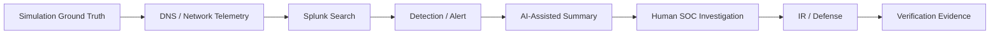

# Scenario Matrix

The four scenarios use one permanent lab foundation and add only the scenario-specific components and telemetry they need.

| # | Scenario | DNS / network behavior | Detection focus | MITRE ATT&CK | Response objective |
|---|---|---|---|---|---|
| 01 | DNS Reconnaissance & Enumeration | Multiple A, AAAA, MX, NS and TXT lookups; authority/recursion observations; follow-up web activity | Record-type diversity, query rate, unique names, source behavior, DNS-to-web correlation | T1590.002 — Gather Victim Network Information: DNS | Identify source and scope; reduce unnecessary exposure; verify the control |
| 02 | DGA + High NXDOMAIN | Many generated/random-looking names and failed resolutions | NXDOMAIN ratio, domain length/randomness, query volume, unique domains, client/process context | T1568.002 — Dynamic Resolution: Domain Generation Algorithms | Identify affected client, contain the behavior, introduce controlled DNS sinkhole/deny behavior when appropriate |
| 03 | Fast Flux DNS | One name resolves to changing IP addresses with short TTLs | Answer churn, TTL, unique destination count, time correlation and network flows | T1568.001 — Dynamic Resolution: Fast Flux DNS | Detect changing infrastructure, investigate connections and prevent access to the controlled malicious namespace |
| 04 | DNS Tunneling | Long/encoded harmless labels and unusual query patterns | Label length, entropy/randomness, TXT/A activity, query size/frequency, repeated parent domain and endpoint/network relationship | T1071.004 — Application Layer Protocol: DNS; T1572 where the implemented behavior fits | Isolate/contain the source, sinkhole or block the controlled domain and prove the tunneling behavior stops |

## Scenario design rule

MITRE mapping follows the **behavior actually generated and detected**. A technique is not added just because it sounds related. If the implementation changes, the mapping is reviewed before the scenario is marked complete.

## Common evidence model

Every scenario should eventually collect enough evidence for this chain:

