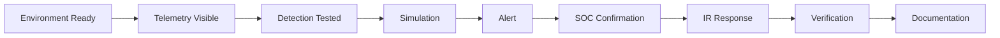

# Team Roles

The project uses four rotating roles. Nobody waits for another person to finish an entire phase; each role has preparation, live-session and documentation work that can run in parallel.

## Role responsibilities

### Project Lead / Attack Simulation Operator

Coordinates the scenario and makes sure the environment, network path and dependencies work together. The Project Lead operates the authorized simulation for that scenario and records exact timing/actions as ground truth.

Typical work:
- coordinate AWS and scenario readiness;
- verify required connectivity without opening unnecessary access;
- maintain the execution timeline;
- run the approved simulation;
- preserve ground-truth commands and timestamps;
- coordinate final verification and repository evidence.

### SOC Analyst / Threat Hunter

Owns the human investigation. The analyst reviews the alert, raw DNS/network evidence and surrounding context before deciding whether activity is expected, suspicious or confirmed malicious.

Typical work:
- prepare investigation searches and questions;
- review source, query, record type, time, frequency and response behavior;
- correlate DNS activity with web/network/system evidence when available;
- compare AI output with raw Splunk events;
- determine scope and document the evidence-backed conclusion.

### Detection Engineer / AI Integrator

Turns the scenario's threat behavior into measurable, testable detection logic.

Typical work:
- verify the required data and fields are available;
- define a detection hypothesis;
- build and tune SPL searches and alerts;
- test normal traffic against simulated attack traffic;
- document false positives, thresholds and MITRE mapping;
- define which alert fields are useful for AI-assisted summarization.

### Incident Responder / Defender

Takes over when the SOC confirms an incident or when the exercise reaches the response checkpoint.

Typical work:
- prepare the response playbook before execution;
- preserve relevant evidence and establish scope;
- select an authorized containment action;
- reduce unnecessary exposure where appropriate;
- verify the response changed the observed behavior;
- document containment, recovery and final status.

## Rotation matrix

| Scenario | Project Lead | SOC Analyst | Detection Engineer | IR / Defender |
|---|---|---|---|---|
| 01 — DNS Recon | Abdul-Rehman | Musfira | Sonia | Lubaba |
| 02 — DGA + NXDOMAIN | Musfira | Sonia | Lubaba | Abdul-Rehman |
| 03 — Fast Flux | Sonia | Lubaba | Abdul-Rehman | Musfira |
| 04 — DNS Tunneling | Lubaba | Abdul-Rehman | Musfira | Sonia |

After four scenarios, every member has performed each primary role once.

## Shared working rule

All four members should understand the complete chain even when they do not own every action:

AI is infrastructure shared by the team, not a fifth role. The SOC Analyst makes the final triage decision; response actions remain human-approved.
