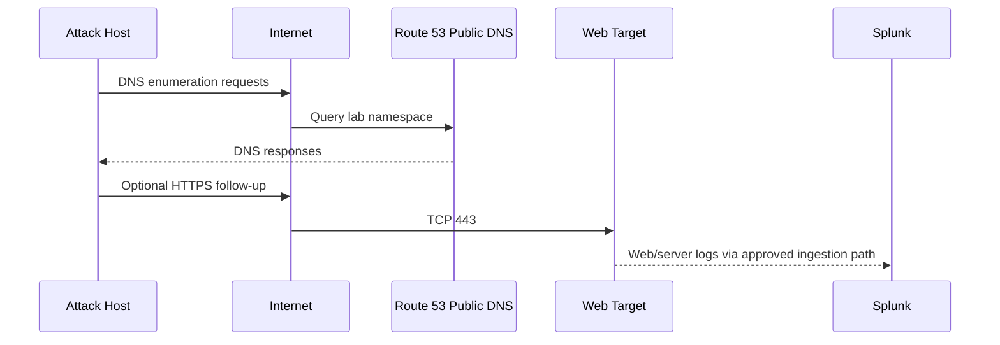
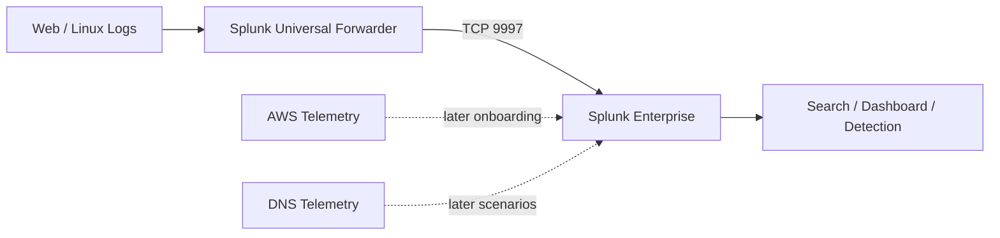

# Traffic Flow

The lab has separate traffic paths for public scenario activity, SOC access, log ingestion and later defensive DNS work.

## Scenario 01 public path



The attack host reaches the public namespace and web target without a private route to the SOC VPC.

## Team management path

```text
Team browser -> Internet -> Splunk Web :8000
                         -> restricted to team source IPs

Team admin   -> AWS Systems Manager -> EC2
             -> no general-purpose public SSH required
```

## Log path



## Later defensive DNS path

Later scenarios introduce a team-controlled resolver inside the monitoring subnet. At that stage the victim's DNS path changes from direct upstream resolution to a defender-visible path that can be logged and, after an IR decision, sinkholed or denied.

That later path is documented here as architecture only; its AWS/system implementation is added to the build folders when it exists.
